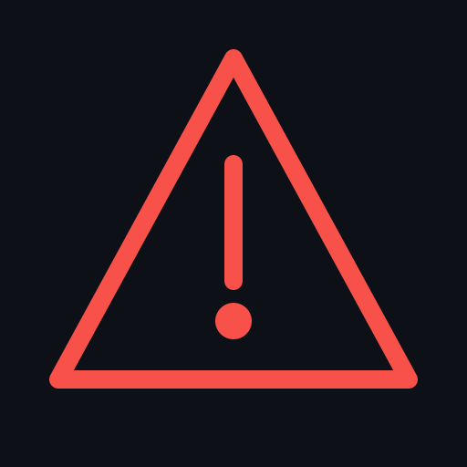

<p align="center">
  
</p>

<h1 align="center">DRMSA</h1>
<p align="center"><strong>Disaster Risk Management Reporting Platform</strong></p>
<p align="center">A free, open-source platform for South African municipal disaster risk management officials.</p>

<p align="center">
  
  
  
</p>

---

## What is DRMSA?

DRMSA is a Progressive Web App (PWA) designed for disaster risk management officials in South African municipalities. It supports partial parts of the DRM cycle — from hazard assessment through to situational reporting, mitigation planning and stakeholder directory — all in a single platform, accessible from any device including mobile.

The platform is built on the principles of the **Disaster Management Act 57 of 2002** and supports the preparation, response and recovery (in partial) phases of disaster management at local government level and for disaster relief NGO use.

---

## Features

### HVC Assessment Tool
Conduct Hazard, Vulnerability and Capacity (HVC) assessments. Score each hazard across four dimensions (Affected Area, Probability, Frequency, Predictability), assess vulnerability across PESTE factors, and evaluate capacity across six dimensions. The tool calculates Hazard Score, Vulnerability Score, Capacity Score, Resilience Index and Risk Rating automatically. A risk matrix and risk reference guide are built in.

### Ward Hazard Map
View your municipality's wards colour-coded by risk level on an interactive map. Ward boundaries are loaded from the Municipal Demarcation Board (MDB) ArcGIS API. The map supports zoom, pan and tap-to-view ward risk details.

### IDP Linkage & Mitigation Register
Link mitigations directly to your Integrated Development Plan (IDP) with ward-level and street-level spatial specificity. Record the exact location, intervention description, responsible department, budget vote number, cost estimate and DRR strategy for each mitigation. Export the full register by email.

### Situation Reports (SitReps)
Create, update and share Situation Reports for active incidents. Optionally link existing road closures and shelter activations to a SitRep. Share via WhatsApp, email or your municipality's social media pages.

### Mop-up Reports
Record post-incident assessments including damages, lessons learned, recommendations and sign-off. Link completed Mop-up reports back to SitReps.

### Shelters & Relief Operations
Register emergency shelters with capacity, occupancy, GPS coordinates and accessibility information. Track relief operations with distribution points, schedules and responsible organisations. Publish shelter status live.

### Road Closures & Alternative Routes
Record road closures with reasons, ward numbers and authority. Add alternative routes with extra distance, vehicle suitability and road condition. Publish closures live and share via social media.

### Stakeholder Directory
Maintain a full directory of emergency stakeholders including SAPS, EMS, Fire Brigade, SANDF, NGOs, utilities and community organisations. Export the directory as CSV (opens in Excel) or PDF. Stakeholders serve as hazard owners in HVC assessments.

### Disaster Admin Panel
Manage your municipality's users, settings and API keys. Approve new users, assign roles, set weather API keys, and configure your municipality's social media links for sharing.

---

## Creating an Account

### First signup for a new municipality to see features, workflow and logic
1. Go to the DRMSA platform URL
2. Click **Create account**
3. Fill in your name, email and password
4. Select your municipality from the dropdown — all 252 South African local and district municipalities are listed
5. Click **Register**
6. Check your email for a confirmation link from Supabase — click it to confirm your address
7. Sign in — as the first person to register for your municipality, your account is automatically activated as a **Disaster Officer**
8. Complete the five-step setup wizard to confirm your municipality details

### Subsequent users from the same municipality
- New registrations are set to **Pending** until approved by a Disaster Officer or Admin
- The Disaster Officer approves users from **Disaster Admin Panel → Users**
- Roles available: Disaster Officer, IDP Planner, Viewer

### Roles and access
| Role | Access |
|------|--------|
| **Admin** | Platform-wide system access only for only for demo |
| **Disaster Officer** | Full access to all features, user management for own municipality |
| **IDP Planner** | Mitigations, IDP linkage, assessments |
| **Viewer** | Read-only access |

---

## Setting Up APIs

### Weather API (optional but recommended)
DRMSA supports weather warnings from three providers. You will need to register for a free API key from one of these services:

- **OpenWeatherMap** — [openweathermap.org/api](https://openweathermap.org/api) — recommended, free tier available
- **WeatherAPI.com** — [weatherapi.com](https://www.weatherapi.com)
- **Tomorrow.io** — [tomorrow.io](https://www.tomorrow.io)

Once you have a key:
1. Go to **Disaster Admin Panel → Weather API settings**
2. Select your provider
3. Paste your API key
4. Enter your municipality's latitude and longitude (centre point)
5. Click **Test connection**

### Social media links (for sharing)
To enable sharing to your municipality's social media pages:
1. Go to **Disaster Admin Panel → Municipality settings → Social media links**
2. Enter your municipality's Facebook page URL, X/Twitter handle, WhatsApp number and website
3. Click **Save settings**

Once configured, all share buttons throughout the app will use your municipality's accounts. If social links are not configured, a prompt will appear when users try to share.

---

## How to Use the Platform

### Starting an HVC Assessment
1. Click **HVC Tool** in the navigation
2. Click **+ New assessment**
3. Enter a label (e.g. "Summer 2025") and your details
4. Work through each hazard category tab — tick the checkbox on a hazard to mark it as applicable to your area
5. Score each dimension using the dropdown — a hint text will appear explaining what each score means
6. Select which wards are affected and assign role players (hazard owners) from your stakeholder directory
7. Click **Save assessment**

### Creating a SitRep
1. Click **SitRep** in the navigation
2. Click **+ New SitRep**
3. Fill in the incident details — only link road closures and shelters that are part of this specific incident
4. Click **Save SitRep** — the form will close and confirm success
5. Share via the Share button — choose WhatsApp, email or social media

### Adding a mitigation to the IDP register
1. Click **IDP Linkage** in the navigation
2. Click **+ Add mitigation** or use **Library suggestions** to import a pre-built mitigation
3. Select the hazard, ward(s), and enter the **specific location** — be as precise as possible (street name, bridge name, GPS coordinates)
4. Enter the intervention description in enough detail for a project brief
5. Link to the correct IDP KPA and budget vote number
6. Click **Save mitigation**

---

## File Structure

```
drmsa/
├── index.html                  # App shell, router, auth panels, top navigation
├── manifest.json               # PWA manifest
├── sw.js                       # Service worker for offline caching
├── functions/
│   └── api/
│       └── config.js           # Hosting server Function — serves env vars
├── css/
│   ├── main.css                # Design tokens, layout, components
│   ├── auth.css                # Login and registration screens
│   ├── dashboard.css           # KPI cards, ward map, hazard table
│   ├── community.css           # Shelters and relief operations
│   ├── sitrep.css              # Situation reports
│   ├── mopup.css               # Mop-up reports
│   ├── share.css               # Share modal
│   └── onboarding.css          # Setup wizard
├── js/
│   ├── supabase.js             # Supabase client initialisation
│   ├── auth.js                 # Authentication flows
│   ├── app.js                  # Router, navigation, theme
│   ├── onboarding.js           # First-run setup wizard
│   ├── dashboard.js            # KPIs, ward map, hazard table
│   ├── hvc.js                  # HVC Assessment Tool
│   ├── community.js            # Shelters and relief operations
│   ├── routes.js               # Road closures and alternative routes
│   ├── sitrep.js               # Situation reports
│   ├── mopup.js                # Mop-up reports
│   ├── idp.js                  # IDP linkage and mitigation register
│   ├── stakeholders.js         # Stakeholder directory
│   ├── admin.js                # Disaster Admin Panel
│   ├── profile.js              # User profile settings
│   ├── share.js                # Share modal and channels
│   ├── pwa.js                  # PWA install banner
│   └── svg-images.js           # Share image library
├── icons/
    ├── favicon.svg
    ├── icon-192.svg
    ├── icon-512.svg
    └── icon-maskable.svg

```

---

## Credits

**Platform created by Diswayne Maarman**
Built to support disaster risk management practitioners in South African local government.

**HVC Assessment Framework**
The Hazard, Vulnerability and Capacity (HVC) assessment methodology implemented in this platform is adapted HVC assessment excel sheet. The original scoring framework, risk matrix and indicators were developed within the **South African disaster management fraternity** and are widely used by municipal disaster management officials across all nine provinces. Credit and acknowledgement are given to the practitioners, academics and government officials who developed and refined this framework over many years of implementation experience.

**Ward boundaries**
Municipal ward boundary data is sourced from the **Municipal Demarcation Board (MDB)** via their public ArcGIS REST API. Ward data is the property of the MDB and is used in accordance with their public data access provisions.


---

## Disclaimer

DRMSA is provided as a tool to support — not replace — the professional judgement of qualified disaster risk management officials. All assessments, reports and decisions made using this platform remain the responsibility of the municipality and its designated officials.

Ward boundary data is sourced from the MDB and may not reflect the most recent demarcation changes. Always verify with the official MDB data portal for legal boundary purposes.

Weather warnings are sourced from third-party weather API providers and are not official SAWS alerts. For official severe weather warnings, always consult the South African Weather Service at [saws.ac.za](https://www.saws.ac.za)or intergrate the SAWS severe weahter API.

---

## Licence

Licensed under the **Apache License 2.0** — see [LICENSE](LICENSE) for details.

You are free to use, modify and distribute this software for any purpose, including commercial use, subject to the terms of the Apache 2.0 licence. We encourage municipalities, NGOs and DRM practitioners to adapt this platform for their specific needs.

---

<p align="center">Made with purpose for South African communities · Apache 2.0</p>
